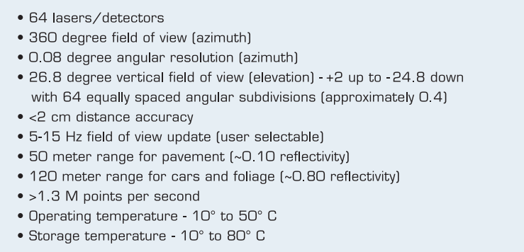

## 自动驾驶项目集
> This is repository is for the self-driving car project sets.

### 1, Udacity for Lidar obstacle detection
**概述：** 激光雷达障碍物识别，在本项目中处理原始激光雷达数据，通过对3D点云数据进行过滤，分割和聚类从而检测道路行驶中的车辆，行人等障碍物；使用平面模型拟合实现RANSA算法以分割点云。而且利用KD-Tree算法进行欧氏聚类，对车辆和障碍物进行聚类和区分。

**关键技术：**
- Lidar传感器，工作原理，应用。
  > 激光雷达传感通过发送数千个激光信号为我们提供高分辨率数据。这些激光从物体反射回来，然后返回传感器，然后我们可以通过计时信号返回所需的时间来确定物体的距离。我们也可以通过测量返回信号的强度来了解被击中的物体。每条激光射线都在红外光谱中，并以许多不同的角度发出，通常在 360 度范围内。虽然激光雷达传感器为我们周围的世界提供了非常高精度的 3D 模型，但它们目前非常昂贵，一个标准单元的价格高达 60,000 美元。
  > 
  - 激光雷达以不同的角度发送数千条激光射线。
  - 激光被发射，被障碍物反射，然后使用接收器进行检测。
  - 根据发射和接收激光之间的时间差，计算距离。
  - 还接收激光强度值，并可用于评估激光反射的物体的材料特性。   
- 3D点云，点云表示
  - 点云数据（简称 PCD）的格式存储
- [Point Cloud Library(PCL) ](https://pointclouds.org/)
- 3D点云分割
- 2D RANSAC(RANdom Sampling and Consensus 随机抽样一致算法) 和 [3D RANSAC](https://medium.com/@ajithraj_gangadharan/3d-ransac-algorithm-for-lidar-pcd-segmentation-315d2a51351)
- 欧几里得聚类
- KD-Tree 
- Bounding Box
- PCL 过滤，分割，聚类
- C++ 编程， CMake
