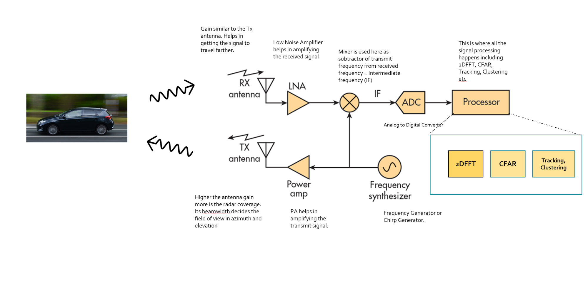

## 自动驾驶项目集
> This is repository is for the self-driving car project sets.

### 1, Udacity for Lidar obstacle detection
**概述：** 激光雷达障碍物识别，在本项目中处理原始激光雷达数据，通过对3D点云数据进行过滤，分割和聚类从而检测道路行驶中的车辆，行人等障碍物；使用平面模型拟合实现RANSA算法以分割点云。而且利用KD-Tree算法进行欧氏聚类，对车辆和障碍物进行聚类和区分。
**步骤：**
- 1，将过滤后的云分割成两部分，道路和障碍物；
- 2，对障碍物云进行聚类；
- 3，找到集群的边界框.

**关键技术：**
- Lidar传感器，工作原理，应用。
  > 激光雷达传感通过发送数千个激光信号为我们提供高分辨率数据。这些激光从物体反射回来，然后返回传感器，然后我们可以通过计时信号返回所需的时间来确定物体的距离。我们也可以通过测量返回信号的强度来了解被击中的物体。每条激光射线都在红外光谱中，并以许多不同的角度发出，通常在 360 度范围内。虽然激光雷达传感器为我们周围的世界提供了非常高精度的 3D 模型，但它们目前非常昂贵，一个标准单元的价格高达 60,000 美元。
  > 
  - 激光雷达以不同的角度发送数千条激光射线。
  - 激光被发射，被障碍物反射，然后使用接收器进行检测。
  - 根据发射和接收激光之间的时间差，计算距离。
  - 还接收激光强度值，并可用于评估激光反射的物体的材料特性。   
- 3D点云，点云表示
  - 点云数据（简称 PCD）的格式存储
- [Point Cloud Library(PCL) ](https://pointclouds.org/)
- 3D点云分割
- 2D RANSAC(RANdom Sampling and Consensus 随机抽样一致算法) 和 [3D RANSAC](https://medium.com/@ajithraj_gangadharan/3d-ransac-algorithm-for-lidar-pcd-segmentation-315d2a51351)
- 欧几里得聚类
- KD-Tree 
- Bounding Box
- [BOXQ, PCA](https://codextechnicanum.blogspot.com/2015/04/find-minimum-oriented-bounding-box-of.html)
- PCL 过滤，分割，聚类
- PCL for Voxel Grid Filtering and region of interest(ROI).
- Open3D 过滤，分割，聚类
- Eigen Library
- C++ 编程， CMake
- Tracking, Create associations between detections in frames and use that to track objects.

### 2, Udacity for Radar Target detection and Tracking
**概述：** 在本项目中,通过分析雷达信号以检测和跟踪目标。通过校正计算 速度和方向用于径向速度扭曲、噪声和遮挡，应用阈值来识别和 消除错误，过滤数据以跟踪随时间移动的对象。
**步骤：**
- 毫米波雷达参数设置；
- FMCW 设置；
- 移动目标设置和生成；
- 信号处理，距离/多普勒 快速傅立叶变换处理；
- CA-CFAR 检测。

**关键技术：**

- 毫米波Radar传感器，工作原理，应用。
  > 雷达自1930 年代以来一直在使用，当时它们主要被军队用于探测飞机，但从那时起，雷达技术已经取得了长足的进步，如今它们越来越多地用作高级驾驶员辅助系统 (ADAS) 的汽车雷达传感器。下图显示了雷达传感器如何与自动驾驶汽车中的全套其他传感器一起使用：
  > 射频技术和数字信号处理的进步使得以低成本和更小尺寸设计高效雷达成为可能。该雷达能够以准确的速度和空间信息远距离确定目标，使其成为自动驾驶应用的重要传感器。此外，它在黑暗和恶劣天气（雨、雾）条件下感知物体的能力也有助于它覆盖激光雷达或摄像头可能出现故障的领域。
  > 如果遇到障碍物，电磁波就会被反射。如果这些反射波在它们的起源位置再次被接收到，那么这意味着在传播方向上有障碍物。用于雷达的电磁能频率不受黑暗影响，也能穿透雾和云。这允许雷达系统确定由于距离、黑暗或天气原因而肉眼看不见的道路目标的位置。 现代雷达可以从目标的回波信号中提取比其范围更多的信息。

- 信号属性
- FMCW 波形
  - 调频连续波(FMCW) 是频率随时间增加/减少的信号。
  - 
  - 
- 多普勒距离估计 
- FFT(Fast Fourier Transform),快速傅立叶变换，2D FFT
- Clutter（杂波）
- CFAR(CA-CFAR, OS CFAR), 2D CFAR 
- AoA(Angle of Arrival)
- Matlab
- Kalman Filter, Kalman Filter Tracking
