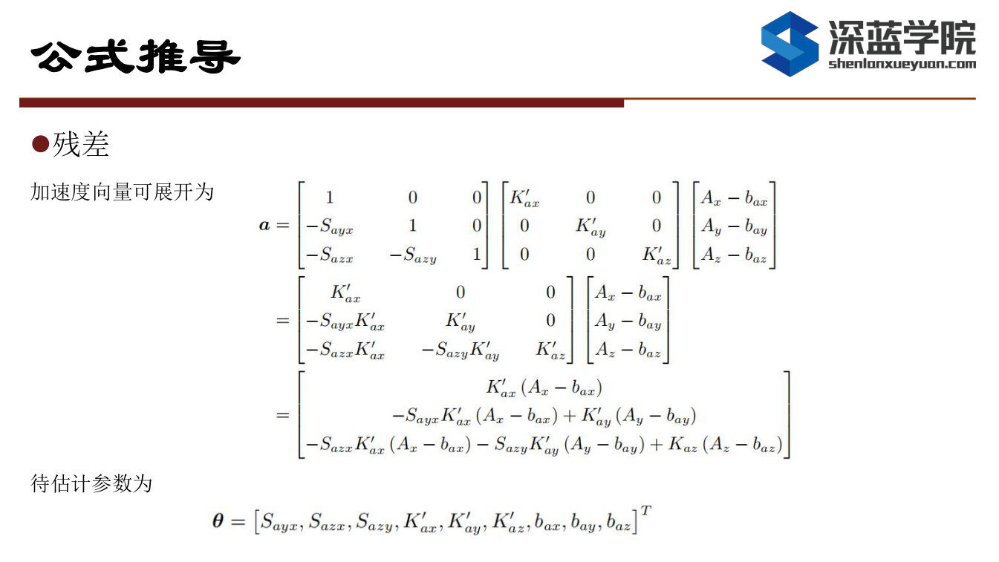
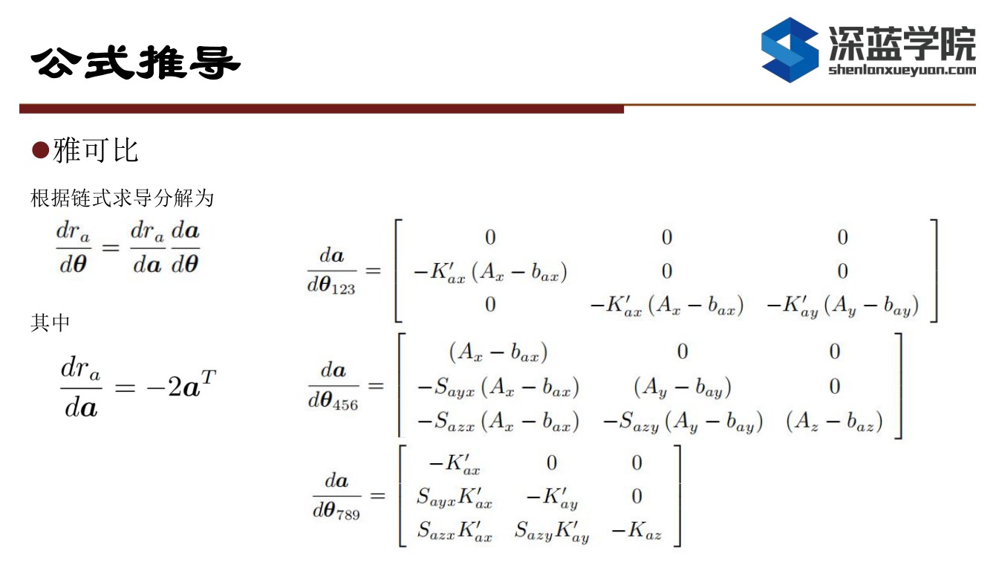
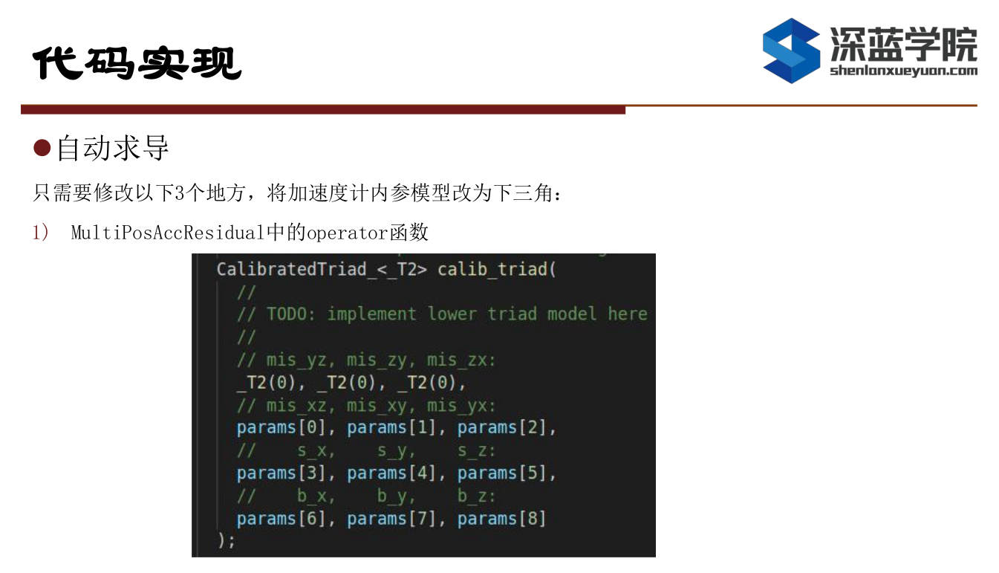
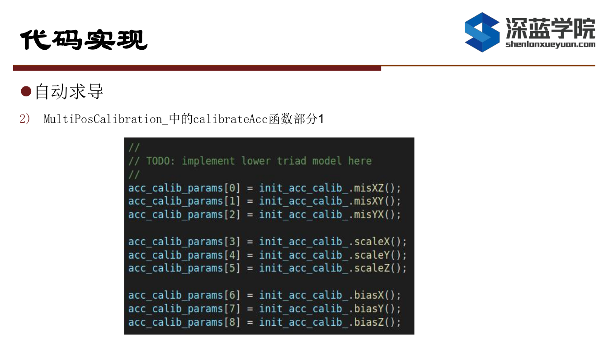
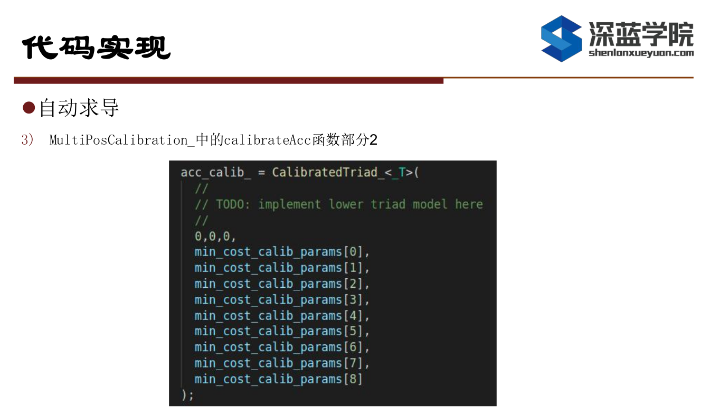
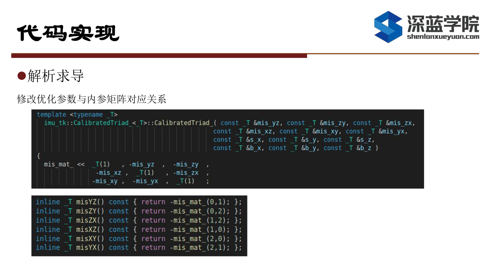
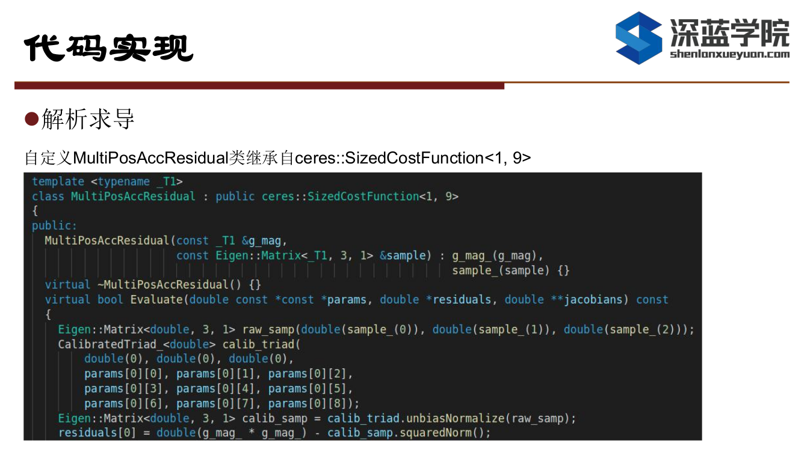
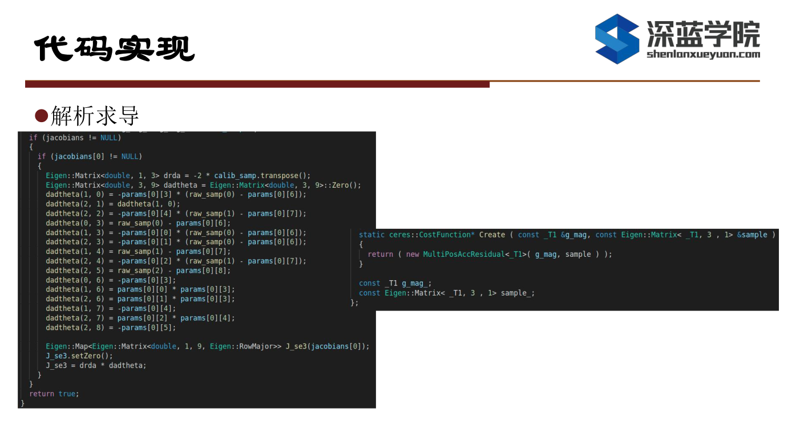

# Multi-Sensor Fusion for Localization & Mapping -- 多传感器融合定位与建图: IMU Calib

深蓝学院多传感器融合定位与建图第5节IMU Calib作业提示.

---

## Overview

本作业旨在加深对不依赖转台的标定方法的理解.

---

## Hints

### 及格要求: 完成雅克比推导, 且结果正确

### 良好要求: 完成新的内参模型下的标定, 且结果正确

### 优秀要求: 使用解析式求导完成标定, 且结果正确

---

## Wrap-Up

Keep Learning & Keep Coding

